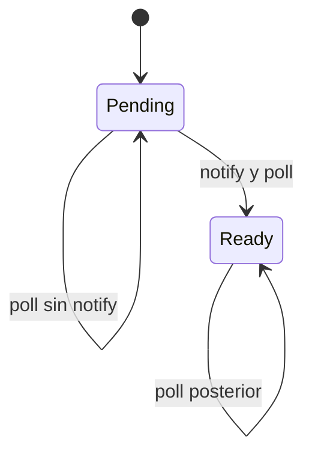

# De Espera Bloqueante a Trabajo Cooperativo

> **Curso:** Rust Async · **Capítulo:** 01 · **Prerequisitos:** Rust básico y
> nociones de concurrencia · **Código:** `src/cooperative.rs` · **Estado:** draft

## Introducción

Una tarea asíncrona no hace que una operación termine antes: evita retener un
hilo cuando la operación todavía no puede avanzar. Aquí se construye el modelo
mental que precede a `Future`, `Poll` y los runtimes.

## Motivación

Un servidor que espera una respuesta de red por conexión puede tener miles de
esperas y poco trabajo de CPU. Un hilo bloqueado por cada espera convierte esas
pausas en memoria de pila, cambios de contexto y presión sobre el scheduler.

## Fundamentos

Una tarea cooperativa devuelve `Pending` cuando no puede progresar. Cede el
control, recibe una notificación cuando ocurre el evento esperado y entonces
puede volver a ser sondeada. `Ready` es terminal para el modelo del capítulo.



Las invariantes completas viven en la [nota de diseño](./design/01-espera-cooperativa.md).

## Alternativas

El código bloqueante es claro con poca concurrencia. Un pool de hilos limita
recursos, pero puede saturarse si todo el pool espera E/S. Callbacks comparten
la eficiencia de eventos, a cambio de fragmentar el flujo. La cooperación es
útil cuando hay muchas esperas independientes, no para cálculos largos de CPU.

## Implementación

`CooperativeTask` modela una notificación como un evento explícito. Sondearla
dos veces sin `notify` no la completa: no hay espera activa ni progreso mágico.

```rust
use rust_async::cooperative::{CooperativeTask, Progress};

let mut task = CooperativeTask::new();
assert_eq!(task.poll(), Progress::Pending);
task.notify();
assert_eq!(task.poll(), Progress::Ready);
```

## Complejidad Y Límites

`notify` y `poll` son O(1). El modelo no promete equidad, cola de despertares,
cancelación ni paralelismo; esos contratos requieren piezas posteriores.

## Ejemplos

Ejecuta `cargo run --example cooperative_basic` para observar una tarea ceder y
reanudar, o `cargo run --example cooperative_event_loop` para un scheduler
manual mínimo.

## Ejercicios

1. Nivel 1: demuestra que dos sondeos sin notificación conservan `Pending`.
2. Nivel 2: agrega una función que cuente sondeos sin cambiar el contrato.
3. Nivel 3: modela dos tareas y notifica solo una.
4. Nivel 4: discute qué datos adicionales requeriría una cola justa de tareas.

Las soluciones de los primeros tres niveles están en `examples/soluciones/`.

## Referencias

- [Trait `Future` de Rust](https://doc.rust-lang.org/std/future/trait.Future.html)
- [Módulo `std::task`](https://doc.rust-lang.org/std/task/)
