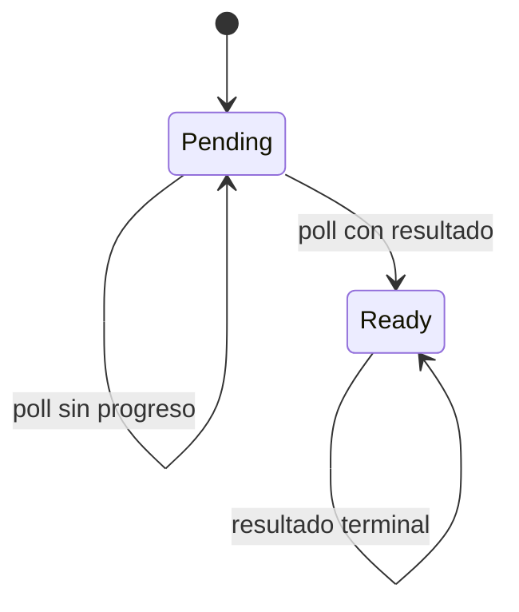

# Future y Poll

> **Curso:** Rust Async · **Capítulo:** 02 · **Código:** `src/educational_future.rs` · **Estado:** draft

## Introducción

Un `Future` es una operación que puede necesitar varias oportunidades para
terminar. `Poll` expresa si hay resultado ahora, sin bloquear al executor.

## Problema y Fundamentos

Una API bloqueante obliga al llamador a esperar; un future conserva estado y
devuelve `Poll::Pending` hasta poder devolver `Poll::Ready(valor)`. `Ready` es
terminal. `Pending` no significa que deba sondearse en un bucle: el capítulo
siguiente explica cómo un waker solicita el siguiente intento.



## Alternativas y Límites

Callbacks fragmentan el control; hilos bloqueantes consumen recursos durante la
espera. Un future separa estado y scheduling, pero por sí solo no aporta
notificación, equidad, cancelación ni paralelismo.

## Implementación

`CountdownFuture` es un modelo determinista: devuelve `Pending` el número
configurado de veces y después conserva `Ready(0)`.

```rust
use rust_async::educational_future::CountdownFuture;
use std::task::Poll;

let mut future = CountdownFuture::new(1);
assert_eq!(future.poll(), Poll::Pending);
assert_eq!(future.poll(), Poll::Ready(0));
```

## Complejidad, Ejercicios y Referencias

Cada `poll` es O(1). Ejercicios: modelar resultado distinto, registrar sondeos,
componer dos futures y discutir cómo evitar espera activa. Consulta la
[documentación oficial](https://doc.rust-lang.org/std/future/trait.Future.html).
