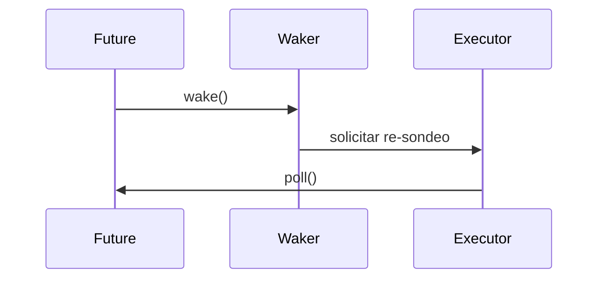

# Waker y Context

> **Curso:** Rust Async · **Capítulo:** 03 · **Código:** `src/educational_waker.rs` · **Estado:** draft

## Introducción

`Waker` permite que una operación pendiente solicite otro sondeo sin conocer la
cola del runtime. `Context` es el vehículo que entrega esa capacidad durante
`poll`.

## Fundamentos

Despertar no termina el future: solo señala que podría progresar. El executor
consume la señal, decide el orden y vuelve a sondear. Señales repetidas pueden
coalescerse para evitar trabajo redundante.



## Modelo Y Límites

`WakeSignal` representa una solicitud pendiente y su consumo. No es un
`std::task::Waker`: no tiene clonación, seguridad entre hilos ni cola real. Su
propósito es aislar la invariante de coalescencia antes del executor.

```rust
use rust_async::educational_waker::WakeSignal;

let mut signal = WakeSignal::new();
signal.wake();
signal.wake();
assert!(signal.take());
assert!(!signal.take());
```

## Ejercicios Y Referencias

1. Comprueba que una señal recién creada no se consume.
2. Modela dos señales independientes.
3. Discute cuándo una cola necesitaría conservar más de una notificación.
4. Explica por qué wake no implica `Ready`.

Consulta [`std::task`](https://doc.rust-lang.org/std/task/) para el contrato de
producción.
