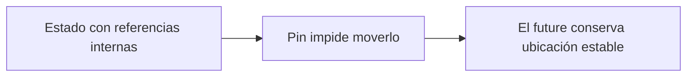

# Pin y Datos Auto-Referenciales

> **Curso:** Rust Async · **Capítulo:** 04 · **Código:** `src/pinned_state.rs` · **Estado:** draft

## Introducción

`Pin` existe cuando una abstracción necesita estabilidad de ubicación. Es común
en futures generados por `async`, cuyo estado puede vivir entre pausas.

## Fundamentos

Un valor `!Unpin` no debe moverse después de fijarlo mediante rutas seguras.
Esto protege diseños que podrían contener referencias internas. `Pin` restringe
operaciones; no convierte toda la memoria en inmutable ni arregla invariantes
que el tipo nunca declaró.



## Modelo Seguro

`PinnedState` representa un estado que puede avanzar sin reemplazar su valor.
No construye auto-referencias reales ni usa `unsafe`: esas técnicas requieren
una revisión humana explícita y quedan fuera de este curso por ahora.

```rust
use rust_async::pinned_state::PinnedState;

let mut state = PinnedState::new("connected");
state.advance();
assert_eq!(state.steps(), 1);
```

## Alternativas, Ejercicios y Referencias

Antes de usar `Pin`, prefiere evitar auto-referencias, usar índices o separar
propiedad. Ejercicios: identificar una referencia interna, rediseñarla con
índices y explicar por qué el modelo no necesita `unsafe`. Consulta la
[documentación oficial de Pin](https://doc.rust-lang.org/std/pin/).
