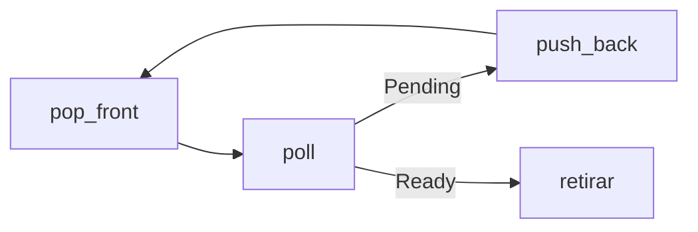

# Tasks y Concurrencia Cooperativa

> **Curso:** Rust Async · **Capítulo:** 06 · **Código:** `src/task_queue.rs` · **Estado:** draft

## Introducción

Las tasks convierten futures en unidades que el executor puede intercalar. La
cooperación funciona solo si cada tarea devuelve el control con rapidez.

## Fundamentos

La cola educativa atiende FIFO. Si una task devuelve `Pending`, vuelve al final;
si devuelve `Ready`, se retira. Esto evita que una tarea pendiente monopolice
el turno, aunque no promete prioridad, deadlines ni paralelismo.



## Implementación y Límites

`TaskQueue` usa tareas de cuenta regresiva para hacer visible el orden. Un
runtime real necesita wakeups, integración de E/S, cancelación y estrategias
para trabajo CPU-bound; una tarea que no cede sigue bloqueando el progreso.

```rust
use rust_async::educational_future::CountdownFuture;
use rust_async::task_queue::TaskQueue;

let mut queue = TaskQueue::new();
queue.push(CountdownFuture::new(0));
assert!(queue.step());
assert!(queue.is_empty());
```

## Ejercicios y Referencias

1. Agrega dos tareas con distinta cuenta regresiva.
2. Registra el orden de retiro.
3. Diseña una política de prioridad y enumera su costo.
4. Explica por qué la cooperación no garantiza paralelismo.

Continúa con [Future](https://doc.rust-lang.org/std/future/trait.Future.html).
