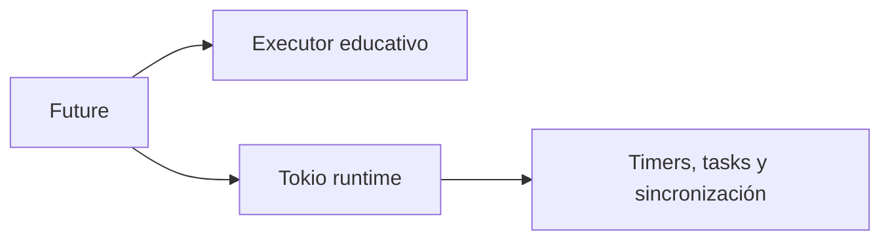

# Tokio y Runtime de Producción

> **Curso:** Rust Async · **Capítulo:** 07 · **Prerequisitos:** capítulos 01–06 · **Estado:** draft

## Introducción

Tokio es un runtime de producción para ejecutar muchas operaciones asíncronas.
Aquí se usa después del executor educativo para conectar contratos aprendidos
con herramientas reales, no para ocultarlos.

## Comparación

El runtime educativo muestra una cola y pasos explícitos; Tokio aporta
scheduling, wakeups, temporizadores y primitivas de coordinación. Ninguno hace
que una tarea CPU-bound que no cede sea cooperativa por sí solo.



## Ejemplos

`tokio::spawn` ejecuta una task y devuelve un `JoinHandle`; `timeout` limita el
tiempo de espera de una operación. Ambos ejemplos usan únicamente las features
explícitas del crate: runtime multihilo, macros, tiempo y sincronización.

```rust
let handle = tokio::spawn(async { 7_u8 });
assert_eq!(handle.await.expect("task should finish"), 7);
```

## Límites y Ejercicios

No se habilita `full`, no se usa `unsafe` y no se reimplementa Tokio. Ejercicios:
comparar el executor propio con `spawn`, añadir un timeout y explicar qué ocurre
cuando una task realiza CPU intensiva sin ceder.

Referencias: [Tokio](https://tokio.rs/) y
[documentación de tokio](https://docs.rs/tokio/).
