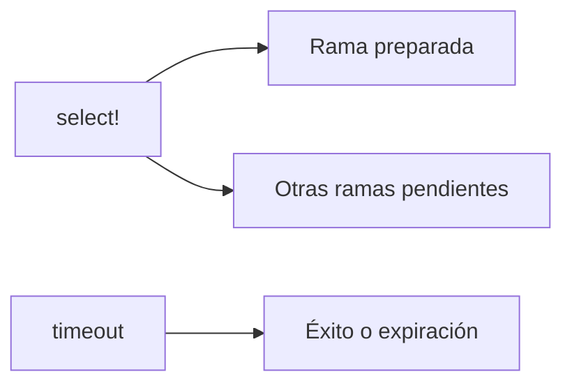

# select!, Cancelación y Timeouts

> **Curso:** Rust Async · **Capítulo:** 08 · **Código:** `src/coordination.rs` · **Estado:** draft

## Introducción

`select!` permite reaccionar a la primera operación preparada. Los timeouts
hacen explícito cuánto se acepta esperar; cancelar exige que cada punto de
suspensión conserve invariantes válidas.

## Fundamentos

Una rama ganadora no demuestra que las demás terminaron. Un timeout devuelve
éxito o expiración, no una conclusión sobre la causa del retraso. Al soltar un
future pendiente puede ocurrir cancelación, por lo que la operación debe ser
segura de abandonar.



## Modelo y Límites

El modelo usa una rama inmediata y otra pendiente para que el resultado sea
determinista. No pretende afirmar equidad del macro ni modelar cancelación de
recursos externos.

```rust
assert_eq!(rust_async::coordination::first_ready().await, "immediate");
```

## Ejercicios y Referencias

1. Añade una tercera rama pendiente.
2. Distingue timeout de error de aplicación.
3. Diseña una operación cancelable por etapas.
4. Explica por qué ganar `select!` no cancela automáticamente todo recurso.

Referencia: [tokio::select!](https://docs.rs/tokio/latest/tokio/macro.select.html).
