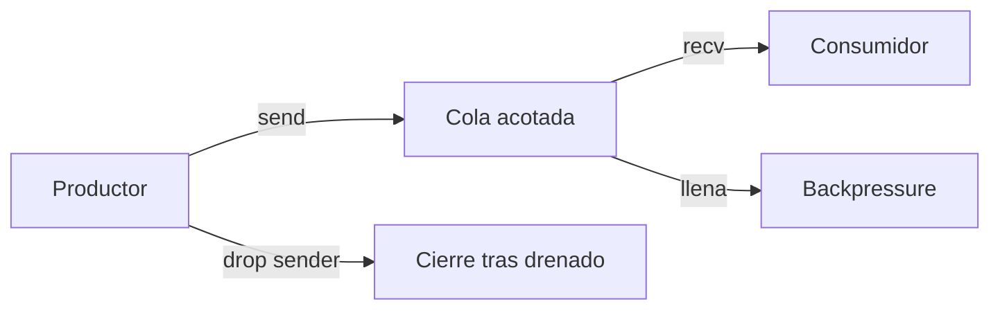

# Canales y Sincronización Asíncrona

> **Curso:** Rust Async · **Capítulo:** 09 · **Prerequisitos:** capítulos 07 y 08 · **Código:** `src/async_channels.rs` · **Estado:** draft

## Concepto

Un canal es una frontera de propiedad entre tareas. El emisor produce mensajes
y el receptor decide cuándo consumirlos; no necesitan ejecutar al mismo ritmo.
La capacidad de la cola convierte ese desacoplamiento en una política concreta:
un canal acotado absorbe trabajo hasta un límite y después ejerce presión sobre
el productor.

## Problema

Una lista protegida por un `Mutex` puede compartir datos, pero no expresa por
sí sola quién consumirá cada elemento, qué sucede cuando se termina la fuente
ni cómo limitar el trabajo acumulado. Un canal aporta esas señales al protocolo
de coordinación.



## Alternativas y Decisión

Un canal no acotado puede ser conveniente cuando existe una cota externa
confiable, pero no debe elegirse para esconder una carga sin límite. El estado
compartido protegido por `Mutex` sigue siendo útil cuando varias tareas deben
consultar el mismo valor; no reemplaza una secuencia de mensajes.

Este capítulo usa `tokio::sync::mpsc::channel` porque ofrece un contrato claro
para un productor y un consumidor. La capacidad pequeña permite ver el límite
sin depender de `sleep`, y el cierre se observa mediante `None` o un error de
envío, nunca como una entrega exitosa ficticia.

## Modelo

El modelo comprueba tres invariantes: una cola de capacidad uno rechaza un
segundo `try_send`, el receptor drena mensajes aceptados antes de observar el
cierre de todos los emisores y un emisor obtiene error si el receptor ya se
cerró.

```rust
assert!(rust_async::async_channels::bounded_channel_applies_backpressure());
assert_eq!(
    rust_async::async_channels::drain_after_senders_close().await,
    vec![1, 2]
);
```

El orden FIFO descrito aquí corresponde a un canal y receptor únicos. Varios
consumidores cambian qué tarea recibe cada mensaje; no deben asumir reparto
justo ni una asignación estable sin definir un protocolo adicional.

## Ejemplo Progresivo

El ejemplo `async_channel_basic` crea un canal acotado, transfiere dos
mensajes, cierra el emisor y permite que el receptor termine al drenar la cola.
Las soluciones muestran cómo observar cola llena, cómo drenar tras el cierre y
cómo tratar el cierre del receptor como error de entrega.

## Ejercicios

1. Cambia la capacidad a uno y explica qué operación queda pendiente cuando el
   receptor todavía no consume.
2. Envía un tipo `enum` con mensajes de trabajo y de cierre explícito.
3. Diseña una política para decidir si conviene esperar, rechazar o agrupar
   trabajo cuando la cola está llena.
4. Compara este canal con un actor que posee estado mutable y procesa mensajes
   secuencialmente.

## Benchmark

No se agrega un benchmark en este capítulo. Medir unos pocos envíos locales no
sostiene una conclusión útil sobre rendimiento: la capacidad, el trabajo del
consumidor, el número de productores y la carga del runtime alteran el
resultado. Cuando el curso incluya una carga de trabajo representativa, la
medición deberá declarar esas condiciones.

## Límites y Referencias

Este modelo no promete prioridad, reparto justo entre receptores ni persistencia
de mensajes. Para esos requisitos se necesita un protocolo y, a menudo, otra
clase de infraestructura.

Referencias: [Tokio mpsc](https://docs.rs/tokio/latest/tokio/sync/mpsc/) y
[Tokio sync](https://tokio.rs/tokio/tutorial/channels).
