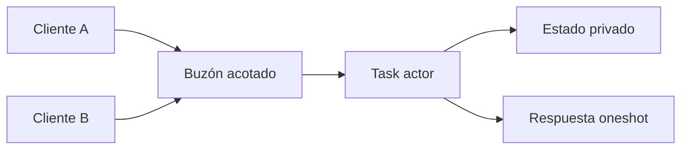

# Modelo de Actores

> **Curso:** Rust Async · **Capítulo:** 10 · **Prerequisitos:** capítulos 07–09 · **Código:** `src/actor_model.rs` · **Estado:** draft

## Concepto

Un actor es una tarea que posee su estado y procesa mensajes de uno en uno.
Sus clientes no cambian ese estado directamente: piden transiciones mediante un
buzón. Esta frontera convierte la propiedad en una decisión visible del diseño.

## Problema

Un canal mueve trabajo, pero no dice quién puede mutar el estado que representa
ese trabajo. Si varias tareas comparten un contador, un inventario o una sesión,
deben coordinar cada acceso. Un actor concentra esa responsabilidad en una
sola task, donde el orden de mensajes decide el orden de las transiciones.



## Alternativas y Decisión

Un `Mutex` es apropiado para una sección crítica pequeña y un canal simple es
apropiado para transferir trabajo. Un actor combina ambas necesidades cuando el
protocolo, el ciclo de vida y la propiedad del estado deben ser explícitos. El
precio es una cola adicional: las operaciones de un actor no se ejecutan en
paralelo entre sí.

El modelo usa `tokio::mpsc` para el buzón y `oneshot` para las consultas. El
contador vive dentro de la task; por tanto, cada consulta recibe el valor que el
actor observa cuando procesa su mensaje, no una lectura especulativa del
cliente.

## Modelo

`CounterMessage::Increment` solicita una transición y
`CounterMessage::Get` transporta el canal de respuesta de una consulta. El
actor termina cuando se cierran todos los emisores, después de procesar los
mensajes que ya aceptó.

```rust
use rust_async::actor_model::{spawn_counter, CounterMessage};
use tokio::sync::oneshot;

let (sender, task) = spawn_counter(2);
sender.send(CounterMessage::Increment(3)).await?;
let (reply, response) = oneshot::channel();
sender.send(CounterMessage::Get(reply)).await?;
assert_eq!(response.await?, 3);
drop(sender);
task.await?;
# Ok::<(), Box<dyn std::error::Error>>(())
```

## Ejemplo Progresivo

`actor_counter_basic` inicia el actor, suma dos cantidades, consulta su estado
y cierra el buzón. Las soluciones recorren un incremento, varias consultas y el
cierre controlado. Cada una trata los errores de envío o respuesta como parte
del protocolo, no como un caso imposible.

## Ejercicios

1. Agrega un mensaje `Reset` y explica qué consultas pueden observar antes o
   después de esa transición.
2. Define un mensaje que devuelva el valor anterior y el nuevo en una sola
   respuesta.
3. Diseña la estrategia de un cliente cuando el buzón está lleno: esperar,
   rechazar o agrupar trabajo.
4. Propón qué mensajes, métricas y persistencia necesitaría un actor de
   reservas antes de considerarlo apto para producción.

## Benchmark

No se añade un benchmark. El costo relevante depende de la capacidad del
buzón, el número de clientes, el trabajo por mensaje y la política del runtime.
Un microbenchmark de contador local no justificaría decisiones de arquitectura.
Una medición futura deberá declarar la carga, el hardware y el comportamiento
ante saturación.

## Límites y Referencias

Este actor no ofrece supervisión, reinicio, persistencia ni entrega confiable.
Una tarea que falla y un canal de respuesta cerrado son fallas distintas que el
cliente debe decidir cómo manejar.

Referencias: [Tokio mpsc](https://docs.rs/tokio/latest/tokio/sync/mpsc/) y
[Tokio oneshot](https://docs.rs/tokio/latest/tokio/sync/oneshot/).
